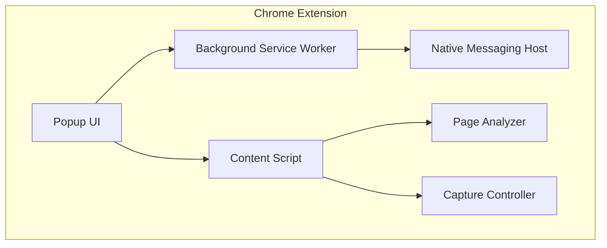

# zkFlow.pro - Comprehensive Planning Document

## 🎯 Project Vision

Create a fully automated YouTube content production pipeline that transforms raw captures into polished, multi-language, SEO-optimized videos ready for publication across multiple platforms.

## 🏗️ System Architecture

### 1. Chrome Extension (Frontend Controller)



**Key Components:**
- **Popup UI**: React-based control panel for workflow management
- **Content Script**: Injects capture controls and monitors page activity
- **Service Worker**: Manages extension lifecycle and API communications
- **Native Host**: Bridge to backend services via Native Messaging API

### 2. Backend Services Architecture

```yaml
services:
  api-gateway:
    - Authentication & routing
    - Rate limiting
    - Request validation
    
  capture-service:
    - Screen recording (OBS Studio integration)
    - Audio capture (multiple sources)
    - Webcam management
    - Real-time streaming
    
  processing-service:
    - FFmpeg video processing
    - Scene detection (PySceneDetect)
    - Audio normalization
    - Format conversion
    
  ai-service:
    - Whisper transcription
    - GPT-4 content generation
    - ElevenLabs voice synthesis
    - DeepL translation
    
  publishing-service:
    - YouTube API integration
    - Scheduling queue
    - Cross-platform distribution
    - Analytics collection
```

### 3. Video Processing Pipeline

```
Raw Capture → Quality Check → AI Analysis → Edit Decision List → 
Automated Editing → Enhancement → Branding → Multi-language → 
SEO Optimization → Thumbnail Generation → Publishing Queue
```

## 📋 Feature Specifications

### Video Capture System

**Trigger Mechanisms:**
1. **Manual Triggers**
   - Global hotkeys (customizable)
   - Extension button click
   - Voice commands via Web Speech API
   - Browser action context menus

2. **Automated Triggers**
   - Calendar integration (Google Calendar API)
   - Git webhooks (commit, PR, release)
   - Time-based schedules (cron)
   - Event listeners (DOM changes, API calls)

**Capture Configuration:**
```json
{
  "sources": {
    "screen": {
      "resolution": "1920x1080",
      "fps": 30,
      "codec": "h264",
      "bitrate": "4000k"
    },
    "webcam": {
      "device": "auto",
      "resolution": "1280x720",
      "position": "bottom-right"
    },
    "audio": {
      "microphone": true,
      "system": true,
      "noise_suppression": true
    }
  },
  "rules": {
    "min_duration": 30,
    "max_duration": 3600,
    "auto_stop_idle": 300
  }
}
```

### Intelligent Editing System

**Scene Detection Algorithm:**
1. Analyze video for scene changes using PySceneDetect
2. Identify "interesting" segments using ML model
3. Remove dead air (silence > 3 seconds)
4. Apply smart cropping to focus areas
5. Generate smooth transitions between scenes

**Branding Pipeline:**
```javascript
const brandingConfig = {
  intro: {
    template: "modern-tech",
    duration: 5,
    logo: "aegntic-logo.png",
    animation: "slide-in"
  },
  watermark: {
    position: "top-right",
    opacity: 0.7,
    size: "10%"
  },
  lowerThirds: {
    style: "minimal",
    font: "Inter",
    showDuration: 5
  },
  outro: {
    duration: 10,
    cta: ["Subscribe", "Watch Next", "Visit Website"],
    socialLinks: true
  }
};
```

### Multi-Language Content System

**Subtitle Generation Flow:**
1. **Transcription**: Whisper API (large-v3 model)
2. **Time Alignment**: Force align with audio
3. **Translation**: DeepL API for accuracy
4. **Quality Check**: GPT-4 review for context
5. **Formatting**: SRT/VTT generation

**Voice-Over Pipeline:**
```python
def generate_voiceover(script, language, voice_profile):
    # 1. Analyze script sentiment and pacing
    sentiment = analyze_sentiment(script)
    
    # 2. Select appropriate voice
    voice = select_voice(language, voice_profile, sentiment)
    
    # 3. Generate speech with prosody markers
    audio = elevenlabs.generate(
        text=script,
        voice=voice,
        model="eleven_multilingual_v2",
        prosody={
            "speed": calculate_speed(script),
            "emotion": sentiment.primary_emotion
        }
    )
    
    # 4. Sync with video timing
    return sync_audio_to_video(audio, video_timeline)
```

### SEO & Metadata Optimization

**Title Generation Strategy:**
1. Analyze video content for key topics
2. Research trending keywords via YouTube API
3. Generate 10 title variations
4. Score based on:
   - Keyword relevance
   - Click-through potential
   - Length optimization (50-60 chars)
   - Emotional triggers

**Thumbnail A/B Testing:**
```javascript
class ThumbnailOptimizer {
  async generateVariants(video) {
    const variants = [];
    
    // Extract key frames
    const keyframes = await extractKeyframes(video);
    
    // Generate designs
    for (const frame of keyframes) {
      variants.push({
        base: frame,
        overlays: generateOverlays(video.title),
        colors: optimizeColors(frame),
        text: generateTextVariants(video.title)
      });
    }
    
    // Start A/B test
    return startABTest(variants, {
      duration: '48h',
      metric: 'click_through_rate',
      min_impressions: 1000
    });
  }
}
```

### Publishing & Distribution

**YouTube Upload Configuration:**
```yaml
upload_settings:
  privacy: "public"  # public, unlisted, private
  category: "auto_detect"
  license: "standard"
  comments: "enabled"
  ratings: "enabled"
  embed: "allowed"
  
scheduling:
  optimize_time: true
  timezone: "viewer_local"
  premiere: 
    enabled: true
    countdown: "2h"
    
monetization:
  ads: true
  mid_roll_frequency: "8m"
  skippable: true
  
features:
  chapters: "auto_generate"
  end_screen: "template_1"
  cards: "auto_suggest"
```

**Cross-Platform Distribution:**
1. **Twitter/X**: Thread with video preview
2. **LinkedIn**: Professional summary post
3. **Reddit**: Relevant subreddit submission
4. **Discord**: Webhook to announcement channel
5. **Email**: Newsletter integration

## 🔧 Technical Implementation

### Database Schema

```sql
-- Videos table
CREATE TABLE videos (
  id UUID PRIMARY KEY,
  title VARCHAR(255),
  description TEXT,
  status ENUM('capturing', 'processing', 'published'),
  youtube_id VARCHAR(50),
  created_at TIMESTAMP,
  published_at TIMESTAMP,
  metadata JSONB
);

-- Analytics table
CREATE TABLE analytics (
  video_id UUID REFERENCES videos(id),
  views INTEGER,
  likes INTEGER,
  comments INTEGER,
  watch_time FLOAT,
  ctr FLOAT,
  updated_at TIMESTAMP
);

-- Workflows table
CREATE TABLE workflows (
  id UUID PRIMARY KEY,
  name VARCHAR(100),
  trigger_type VARCHAR(50),
  config JSONB,
  enabled BOOLEAN,
  last_run TIMESTAMP
);
```

### API Endpoints

```typescript
// Core API routes
POST   /api/capture/start
POST   /api/capture/stop
GET    /api/capture/status/:id

POST   /api/process/video/:id
GET    /api/process/status/:id

POST   /api/publish/youtube
POST   /api/publish/schedule
GET    /api/publish/status/:id

GET    /api/analytics/video/:id
GET    /api/analytics/channel
POST   /api/analytics/refresh

// Workflow management
GET    /api/workflows
POST   /api/workflows
PUT    /api/workflows/:id
DELETE /api/workflows/:id
```

### Security Considerations

1. **Authentication**: OAuth 2.0 with YouTube
2. **Encryption**: AES-256 for stored credentials
3. **Rate Limiting**: Respect YouTube API quotas
4. **Data Privacy**: GDPR-compliant processing
5. **Access Control**: Role-based permissions

## 📊 Performance Targets

- **Capture**: < 5% CPU overhead during recording
- **Processing**: 2x real-time for 1080p video
- **Upload**: Utilize 80% available bandwidth
- **API Response**: < 200ms for all endpoints
- **Scalability**: Handle 100+ concurrent videos

## 🚀 Deployment Strategy

### Development Environment
```bash
# Local development
docker-compose -f docker-compose.dev.yml up
npm run dev
```

### Production Deployment
```yaml
# Kubernetes deployment
apiVersion: apps/v1
kind: Deployment
metadata:
  name: zkflow-backend
spec:
  replicas: 3
  selector:
    matchLabels:
      app: zkflow
  template:
    spec:
      containers:
      - name: api
        image: zkflow/api:latest
        resources:
          requests:
            memory: "512Mi"
            cpu: "500m"
          limits:
            memory: "2Gi"
            cpu: "2000m"
```

## 🎯 Success Metrics

1. **Automation Efficiency**
   - 90% reduction in manual editing time
   - 95% accuracy in scene detection
   - 98% successful auto-publishing rate

2. **Content Quality**
   - 80%+ audience retention
   - 5%+ CTR on thumbnails
   - 4.5+ average rating

3. **Business Impact**
   - 10x content output increase
   - 50% reduction in production costs
   - 200% growth in channel subscribers

## 🗓️ Development Phases

### Phase 1: Core Infrastructure (Weeks 1-4)
- Chrome extension scaffold
- Basic capture functionality
- Backend API setup
- Database design

### Phase 2: Processing Pipeline (Weeks 5-8)
- FFmpeg integration
- Basic editing automation
- Branding system
- Preview functionality

### Phase 3: AI Integration (Weeks 9-12)
- Whisper transcription
- Multi-language support
- SEO optimization
- Thumbnail generation

### Phase 4: Publishing System (Weeks 13-16)
- YouTube API integration
- Scheduling system
- Cross-platform distribution
- Analytics dashboard

### Phase 5: Polish & Scale (Weeks 17-20)
- Performance optimization
- Advanced workflows
- A/B testing system
- Documentation

## 🔄 Future Enhancements

1. **Live Streaming**: Real-time capture to YouTube Live
2. **Collaborative Editing**: Multi-user workflow support
3. **Mobile App**: iOS/Android companion apps
4. **AI Avatars**: Synthetic presenter generation
5. **Blockchain**: Content verification on-chain
6. **Marketplace**: Workflow template sharing

---

This planning document serves as the blueprint for zkFlow.pro development. Regular updates will be made as the project evolves.